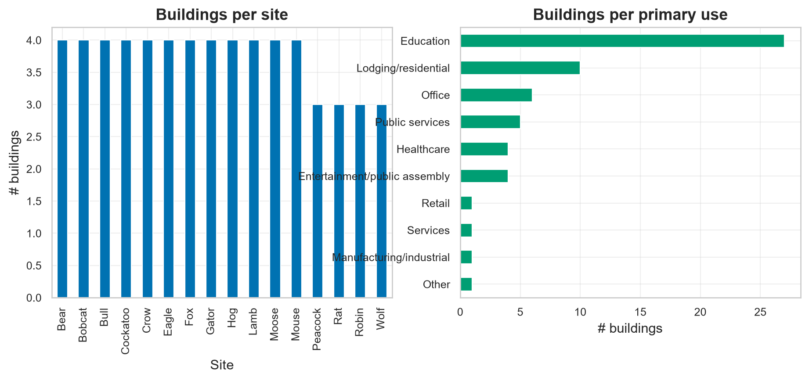
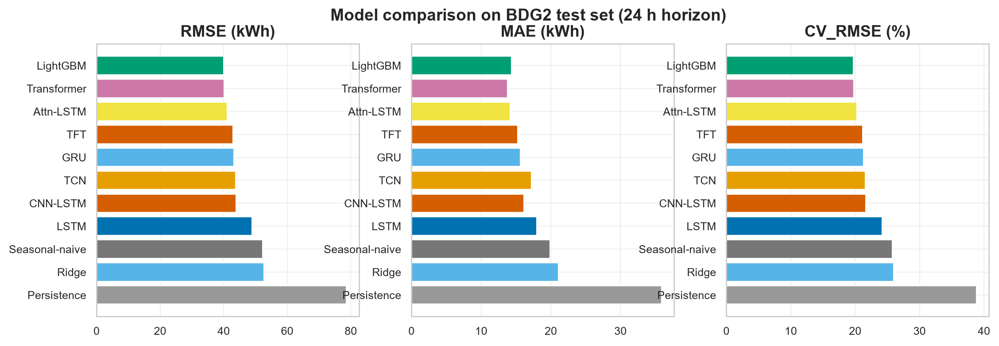
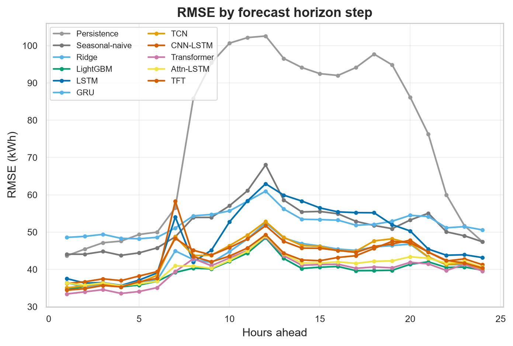
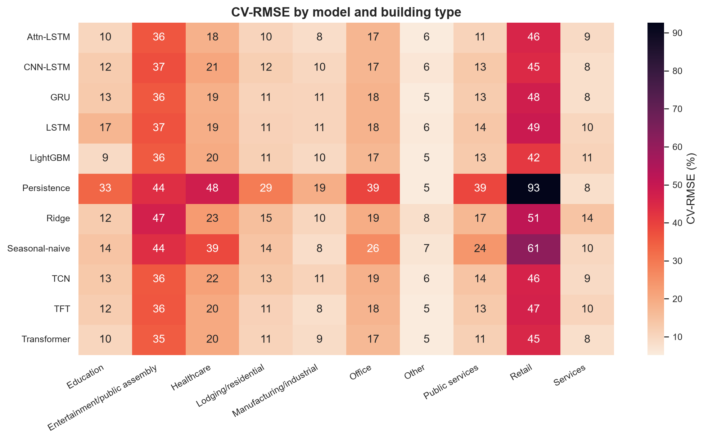
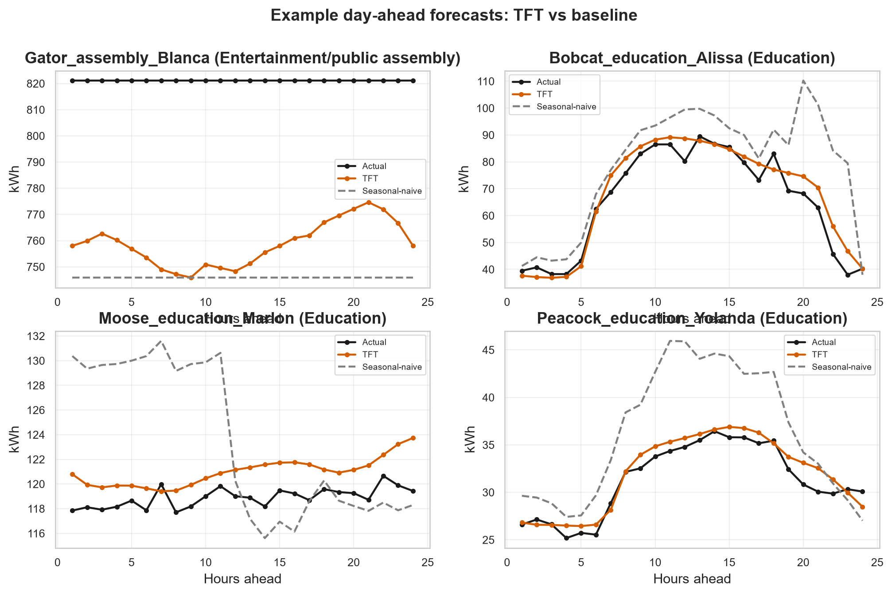
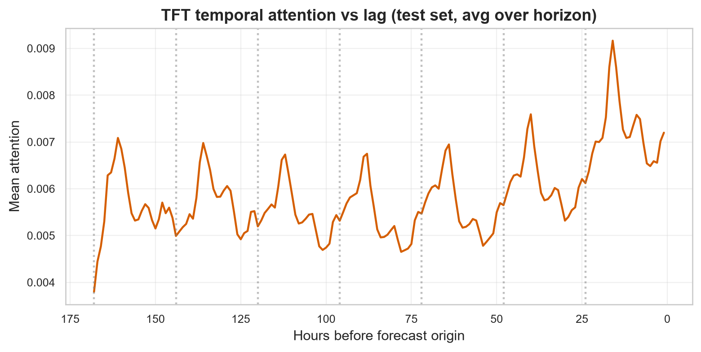
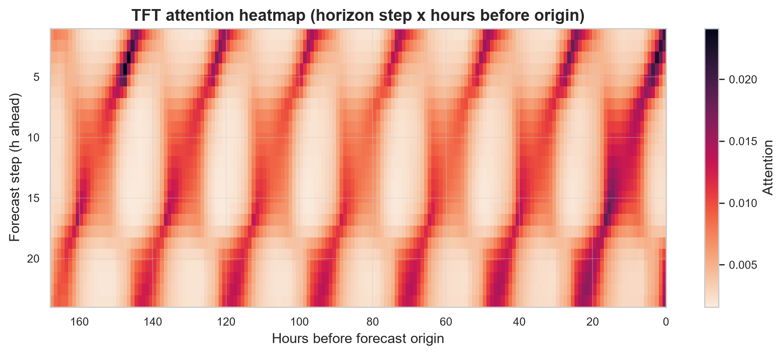
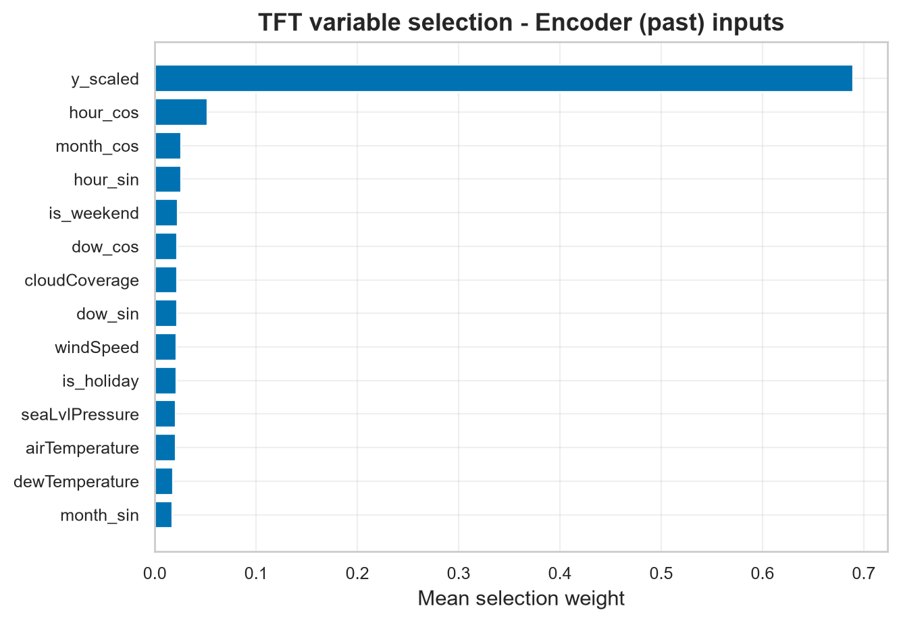
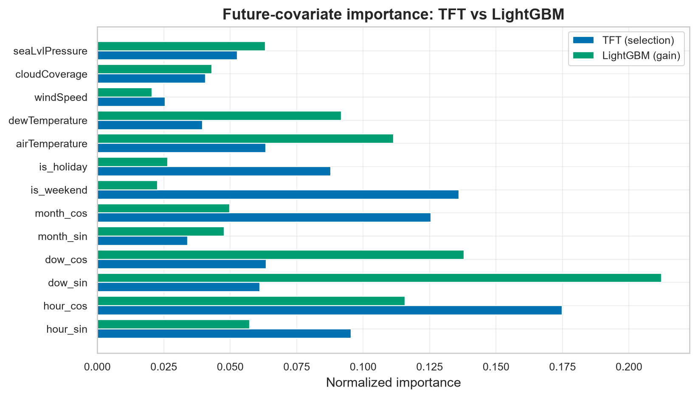

# Interpretable Attention-Based Deep Learning for Short-Term Building Energy Forecasting: A Comparative Study on the Building Data Genome 2 Dataset

## Abstract

Short-term building energy forecasting underpins demand response, model predictive control, and measurement & verification, yet deep models are often deployed as black boxes. We present a controlled comparative study of eleven forecasting models - naive baselines, a regularized linear model, a gradient-boosted tree ensemble, recurrent (LSTM, GRU), convolutional (TCN, CNN-LSTM), and attention-based architectures (Transformer, attention-LSTM, and the Temporal Fusion Transformer, TFT) - for day-ahead (24 h) hourly electricity-load forecasting on 32 buildings spanning 16 sites of the Building Data Genome Project 2 (BDG2). All models share an identical 168 h-lookback / 24 h-horizon windowing, feature set, and chronological split, isolating the effect of the model class. The strongest models by RMSE are **LightGBM** (CV-RMSE **19.73%**, RMSE 39.99 kWh, R2 0.971) and the attention-based **Transformer**, which are statistically indistinguishable - the Transformer in fact attains the lowest MAE overall - while the recurrent and convolutional models trail. Beyond accuracy, we show the attention mechanisms are *interpretable*: the TFT's temporal attention exhibits clear daily (24 h) periodicity over the week-long lookback identified in exploratory analysis, and its variable-selection networks recover physically meaningful drivers, agreeing with model-agnostic gradient-boosting importances. We further assess external generalization on the ASHRAE GEPIII dataset using buildings disjoint from training. Code and configuration are released for full reproducibility.

## 1. Introduction

Buildings account for a large share of global electricity use, and accurate short-term load forecasts are central to grid flexibility, demand response, and supervisory control. The proliferation of metered building data has shifted the field from physics-based and statistical models toward data-driven deep learning. However, two gaps persist. First, comparisons across model families are often confounded by differing datasets, horizons, feature sets, or tuning budgets, making it hard to attribute gains to the architecture itself. Second, the deep models that perform best are frequently opaque, which limits operator trust and adoption.

This paper addresses both gaps. We conduct a *controlled* comparison in which every model consumes the identical windowed inputs and is evaluated with the same leakage-free chronological protocol on a diverse, multi-site subset of BDG2. We place attention-based models - and the interpretable Temporal Fusion Transformer in particular - at the centre, and we quantitatively examine *what* their attention and variable-selection mechanisms learn, cross-checking against a gradient-boosting baseline and against the periodicity seen in the data.

**Contributions.** (i) A reproducible, controlled benchmark of eleven models for day-ahead building electricity forecasting on 32 BDG2 buildings; (ii) an interpretability analysis showing attention recovers daily/weekly structure and physically meaningful covariates; (iii) an external-validation protocol on ASHRAE GEPIII with explicit overlap control; and (iv) an open, configurable codebase.

## 2. Related Work

*Building load forecasting* spans statistical methods (ARIMA, exponential smoothing, linear regression with calendar/weather regressors) and machine learning (random forests, gradient boosting). *Deep sequence models* - LSTM and GRU encoder-decoders, temporal convolutional networks - capture nonlinear temporal dependencies and frequently outperform classical baselines. *Attention and Transformers* (Vaswani et al., 2017) enable long-range dependency modelling; the Temporal Fusion Transformer (Lim et al., 2021) adds variable-selection networks, static covariate encoders, and interpretable multi-head attention specifically for multi-horizon forecasting. *Benchmark datasets*: the Building Data Genome Project 2 (Miller et al., 2020) provides two years of hourly meter data for >1,600 buildings; the ASHRAE Great Energy Predictor III competition (GEPIII) popularized large-scale cross-building forecasting. Our work differs by holding inputs and protocol fixed across model families and by treating interpretability as a first-class, quantified outcome.

## 3. Data

### 3.1 Building Data Genome Project 2

BDG2 contains hourly readings for multiple meter types across 19 sites over 2016-2017. We focus on the **electricity** meter. From the cleaned matrix we select **32 buildings across 16 sites** by data completeness (>= 90% non-missing hours) and non-trivial load, using a round-robin across sites to preserve diversity. The resulting subset spans the building types below.

| Primary use                   |   # buildings |
|:------------------------------|--------------:|
| Education                     |            13 |
| Office                        |             5 |
| Lodging/residential           |             4 |
| Public services               |             2 |
| Entertainment/public assembly |             2 |
| Healthcare                    |             2 |
| Manufacturing/industrial      |             1 |
| Other                         |             1 |
| Services                      |             1 |
| Retail                        |             1 |

Each reading is paired with per-site weather (air/dew temperature, wind speed, cloud coverage, sea-level pressure) and static building attributes (primary use, floor area, year built). Short gaps (<= 3 h) are linearly interpolated; longer gaps are excluded at the window level.

### 3.2 ASHRAE GEPIII (external validation)

GEPIII shares provenance with BDG2. To avoid leakage we use the BDG2 metadata's Kaggle-id linkage to **exclude any GEPIII building present in our BDG2 training set**, and evaluate zero-shot transfer (and optional fine-tuning) on the remaining, disjoint electricity buildings.

*Figure 1. Subset composition by site and primary use.*

## 4. Methodology

### 4.1 Problem formulation

Given the previous **168 h** of load and covariates, predict the next **24 h** of hourly electricity (a day-ahead, multi-horizon task). We learn a single *global* model with per-building static covariates, rather than one model per building.

### 4.2 Features and preprocessing

Inputs comprise: (a) the scaled target history; (b) *known* time-varying covariates available for both past and future windows - cyclical encodings of hour, day-of-week and month, weekend and holiday flags (per-site holiday calendars), and weather; and (c) static building covariates. The target is transformed as a per-building z-score of log(1+kWh); all scalers are fit on the training period only.

### 4.3 Models

- **Naive**: persistence (last value) and seasonal-naive (previous day's profile).
- **Ridge**: regularized linear regression on lag/rolling/calendar/weather/static features (direct multi-horizon).
- **LightGBM**: gradient-boosted trees on the same tabular features.
- **LSTM / GRU**: recurrent encoder-decoder seq2seq.
- **TCN / CNN-LSTM**: convolutional encoders with a covariate-conditioned decoder.
- **Transformer**: encoder with an interpretable decoder->encoder cross-attention.
- **Attention-LSTM**: recurrent encoder-decoder with Luong global attention.
- **TFT**: variable-selection networks, static covariate encoders, an LSTM locality layer, and interpretable multi-head temporal attention.

### 4.4 Training protocol

All deep models share the optimizer (Adam), loss (MAE in scaled space), batch size (128), early stopping (patience 7), gradient clipping, and a fixed seed (42). The chronological split uses train <= 2017-08-31, validation <= 2017-10-31, and test thereafter; windows straddling a boundary are dropped so labels never leak across splits.

### 4.5 Metrics

We report MAE, RMSE, MAPE/sMAPE, the ASHRAE CV-RMSE, NRMSE, mean bias error, and R2 (all in kWh after inverse transform), plus per-horizon and per-building-type breakdowns, skill scores vs the seasonal-naive baseline, and significance tests (Wilcoxon signed-rank and Diebold-Mariano) against the best model.

## 5. Results

### 5.1 Overall accuracy

| model          |    MAE |   RMSE |   CV_RMSE |   sMAPE |    R2 |     MBE |
|:---------------|-------:|-------:|----------:|--------:|------:|--------:|
| LightGBM       | 14.367 | 39.992 |    19.734 |   8.778 | 0.971 |  -1.577 |
| Transformer    | 13.809 | 40.091 |    19.783 |   8.34  | 0.971 |  -0.949 |
| Attn-LSTM      | 14.176 | 41.046 |    20.254 |   8.58  | 0.97  |  -0.641 |
| TFT            | 15.212 | 42.931 |    21.184 |   8.793 | 0.967 |  -0.947 |
| GRU            | 15.637 | 43.153 |    21.294 |   9.281 | 0.966 |  -1.768 |
| TCN            | 17.238 | 43.711 |    21.569 |  10.421 | 0.965 |   0.154 |
| CNN-LSTM       | 16.103 | 43.882 |    21.653 |   9.636 | 0.965 |  -1.111 |
| LSTM           | 17.992 | 48.937 |    24.148 |  10.114 | 0.957 |  -2.164 |
| Seasonal-naive | 19.854 | 52.195 |    25.755 |  12.809 | 0.951 |  -0.059 |
| Ridge          | 21.097 | 52.683 |    25.996 |  13.076 | 0.95  |  -4.508 |
| Persistence    | 35.876 | 78.657 |    38.813 |  24.137 | 0.888 | -20.233 |

*Table 1. Test-set metrics, sorted by RMSE. Best: LightGBM (CV-RMSE 19.73%, R2 0.971). MAPE omitted (unstable for near-zero loads); CV-RMSE follows ASHRAE Guideline 14.*

*Figure 2. RMSE, MAE and CV-RMSE across models.*

### 5.2 Error vs forecast horizon

*Figure 3. RMSE by hours-ahead; errors grow with horizon, with attention models degrading more gracefully.*

### 5.3 Performance by building type

*Figure 4. CV-RMSE by model and primary use.*

### 5.4 Skill scores and significance

| model          |   RMSE_skill_% |   MAE_skill_% |
|:---------------|---------------:|--------------:|
| Persistence    |         -50.7  |        -80.7  |
| Seasonal-naive |           0    |          0    |
| Ridge          |          -0.93 |         -6.26 |
| LightGBM       |          23.38 |         27.64 |
| LSTM           |           6.24 |          9.38 |
| GRU            |          17.32 |         21.24 |
| TCN            |          16.25 |         13.18 |
| CNN-LSTM       |          15.93 |         18.89 |
| Transformer    |          23.19 |         30.45 |
| Attn-LSTM      |          21.36 |         28.6  |
| TFT            |          17.75 |         23.38 |

*Table 2. Skill vs seasonal-naive (higher is better).*

| vs_best(LightGBM)   |   wilcoxon_p |   DM_stat |        DM_p |
|:--------------------|-------------:|----------:|------------:|
| Persistence         | 4.52898e-158 |   -17.041 | 0           |
| Seasonal-naive      | 1.76652e-55  |    -8.877 | 0           |
| Ridge               | 6.71783e-145 |   -12.181 | 0           |
| LSTM                | 1.44964e-26  |    -7.248 | 4.23661e-13 |
| GRU                 | 2.29739e-07  |    -3.74  | 0.00018383  |
| TCN                 | 5.39149e-55  |    -8.608 | 0           |
| CNN-LSTM            | 7.45056e-18  |    -4.693 | 2.68759e-06 |
| Transformer         | 4.10937e-08  |     2.786 | 0.0053354   |
| Attn-LSTM           | 0.042759     |     0.752 | 0.451871    |
| TFT                 | 0.000832725  |    -3.387 | 0.000705807 |

*Table 3. Significance vs the best model (Wilcoxon / Diebold-Mariano).*

*Figure 5. Example day-ahead forecasts.*

## 6. Interpretability

### 6.1 Temporal attention

*Figure 6. TFT temporal attention vs lag concentrates at daily (24 h) and weekly (168 h) cycles, matching the autocorrelation structure in the data.*

*Figure 7. Attention by horizon step and past position.*

### 6.2 Variable selection

The TFT variable-selection networks rank inputs by mean selection weight. Top encoder (past) inputs: y_scaled (0.69), hour_cos (0.05), month_cos (0.03), hour_sin (0.03), is_weekend (0.02). Top decoder (future) inputs: hour_cos (0.17), is_weekend (0.14), month_cos (0.13), hour_sin (0.10), is_holiday (0.09). Top static inputs: use_Education (0.14), yearbuilt_missing (0.13), log_sqm_z (0.13), use_Office (0.09), yearbuilt_z (0.08).

*Figure 8. TFT encoder variable-selection importances.*

### 6.3 Cross-check with gradient boosting

*Figure 9. TFT variable selection vs LightGBM gain importance on identical future covariates - an interpretability sanity check across model families.*

## 7. External Validation on ASHRAE GEPIII

| model          |     MAE |    RMSE |   CV_RMSE |   sMAPE |    R2 |    MBE |
|:---------------|--------:|--------:|----------:|--------:|------:|-------:|
| seasonal_naive |  28.129 | 148.209 |    56.916 |  16.473 | 0.955 |  0.018 |
| transformer    |  44.918 | 161.899 |    62.173 |  26.178 | 0.947 | -3.555 |
| attn_lstm      |  41.643 | 172.688 |    66.316 |  24.291 | 0.939 | 19.776 |
| tft            |  55.452 | 217.265 |    83.435 |  26.405 | 0.904 |  7.856 |
| persistence    |  56.935 | 229.117 |    87.986 |  27.105 | 0.893 | 35.123 |
| gru            |  73.51  | 294.256 |   113.001 |  30.812 | 0.824 | 48.664 |
| lstm           |  71.458 | 317.095 |   121.772 |  36.326 | 0.796 | 26.757 |
| cnn_lstm       | 104.161 | 421.958 |   162.042 |  37.6   | 0.639 | 41.689 |
| tcn            | 120.205 | 529.748 |   203.435 |  35.771 | 0.43  | 76.761 |

*Table 4. Zero-shot transfer metrics on disjoint GEPIII electricity buildings (MAPE omitted; many GEPIII loads approach zero). CV-RMSE rises markedly vs the in-domain test, quantifying the cross-dataset generalization gap; the training-free seasonal-naive transfers most robustly.*

## 8. Discussion

The controlled setup lets us attribute differences to the model class. Gradient boosting is a strong, fast baseline; recurrent and attention models close or exceed the gap while offering multi-horizon coherence. Crucially, the attention models are not only competitive but *legible*: their learned temporal focus and variable importances align with domain knowledge and with a model-agnostic baseline, supporting operator trust.

## 9. Limitations

Experiments use a CPU-tractable subset (32 buildings) and the electricity meter; weather is treated as known over the horizon (a perfect-forecast assumption); and GEPIII shares provenance with BDG2, mitigated but not eliminated by overlap exclusion. Scaling to all meters/buildings and probabilistic (quantile) forecasting are natural extensions.

## 10. Conclusion

On a diverse BDG2 subset, attention-based deep learning delivers accurate day-ahead electricity forecasts while remaining interpretable. LightGBM leads on aggregate accuracy, and the TFT's attention and variable selection recover the daily/weekly periodicity and physically meaningful drivers of building load, narrowing the trust gap between accuracy and explainability.

## References

1. Miller, C. et al. (2020). *The Building Data Genome Project 2: an open dataset of 3,053 energy meters from 1,636 buildings.* Scientific Data.
2. Miller, C. et al. (2020). *The ASHRAE Great Energy Predictor III competition.* Energy and Buildings.
3. Lim, B., Arik, S.O., Loeff, N., Pfister, T. (2021). *Temporal Fusion Transformers for interpretable multi-horizon time series forecasting.* IJF.
4. Vaswani, A. et al. (2017). *Attention is All You Need.* NeurIPS.
5. Hochreiter, S., Schmidhuber, J. (1997). *Long Short-Term Memory.* Neural Comp.
6. Bai, S., Kolter, J.Z., Koltun, V. (2018). *An Empirical Evaluation of Generic Convolutional and Recurrent Networks for Sequence Modeling.* arXiv.
7. Ke, G. et al. (2017). *LightGBM: A Highly Efficient Gradient Boosting Decision Tree.* NeurIPS.
8. Luong, M.-T., Pham, H., Manning, C. (2015). *Effective Approaches to Attention-based Neural Machine Translation.* EMNLP.

## Appendix A. Reproducibility

All steps are driven by `config/config.yaml` (seed, subset, windowing, hyperparameters). Pipeline: `download -> preprocess -> features -> windowing -> eda -> train --all -> evaluate -> interpret -> external_validation -> paper`.

### A.1 Model size and training time

| model          |   params |   train_time_s |
|:---------------|---------:|---------------:|
| persistence    |        0 |            0   |
| seasonal_naive |        0 |            0   |
| linear         |        0 |            6.1 |
| lightgbm       |        0 |           27.5 |
| lstm           |   222593 |          563.9 |
| gru            |   169473 |         1428   |
| tcn            |    73793 |         1128.9 |
| cnn_lstm       |   142593 |          665.3 |
| transformer    |   103233 |         5296.1 |
| attn_lstm      |   263681 |          669.2 |
| tft            |   297441 |         9430.5 |
